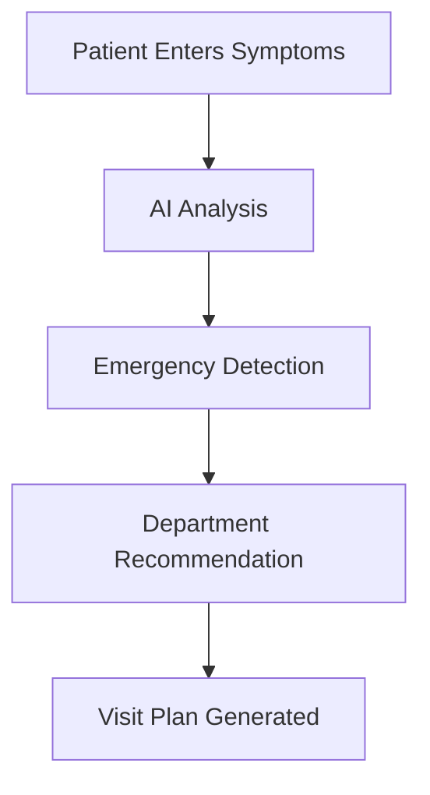

# 🏥 Smart Patient Flow & Pre-Visit Assistant (SPFPA)

<div align="center">

[](https://python.org)
[](https://streamlit.io)
[](LICENSE)
[](https://bharadwaj204-smart-patient-flow-pre-visit-a-enhanced-app-dq7t0t.streamlit.app/)

**AI-Powered Healthcare Pre-Visit Assistant**

*Zero wait times • Smart triage • Patient-first experience*

[🌐 **Try Live Demo**](https://bharadwaj204-smart-patient-flow-pre-visit-a-enhanced-app-dq7t0t.streamlit.app/) | [🚀 Quick Start](#-quick-start) • [✨ Features](#-features) • [🎯 Demo](#-demo) • [📖 Docs](#-documentation)

</div>

---

## 🌟 What is SPFPA?

SPFPA is an AI-powered healthcare application that helps patients prepare for their hospital visits. It provides intelligent symptom analysis, emergency detection, and personalized care recommendations to reduce wait times and improve patient outcomes.

### 🎯 Key Benefits
- **Smart Triage**: AI determines urgency and directs to right department
- **Real-time Info**: Live wait times and hospital capacity
- **Digital Health Records**: Secure patient data management
- **Emergency Detection**: Automatic identification of urgent cases
- **Insurance Integration**: Coverage verification and cost estimates

## ✨ Features

### 🤖 **AI Chat Assistant**
- Talk to AI about your symptoms in plain English
- Get instant recommendations and next steps
- Emergency detection with confidence scoring

### 📱 **Digital Health Passport**
- Secure digital health records
- Visit history and medication tracking
- QR code access for medical teams

### 🔮 **Smart Predictions**
- AI risk assessment and health scoring
- Predict potential health issues
- Personalized prevention tips

### 📊 **Live Hospital Data**
- Real-time wait times
- Emergency room capacity
- Best times to visit

### 🎯 **Symptom Checker**
- Multi-category symptom analysis
- Automatic urgency detection
- Smart department recommendations

## 🚀 Quick Start

### Step 1: Install
```bash
# Clone the project
git clone https://github.com/yourusername/smart-patient-flow-assistant.git
cd smart-patient-flow-assistant

# Install requirements
pip install -r requirements.txt
```

### Step 2: Run
```bash
# Start the main app
streamlit run enhanced_app.py
```

### Step 3: Open
Go to `http://localhost:8501` in your browser

### Optional: AI Features
For advanced AI features, add your OpenAI API key:
```bash
cp .env.example .env
# Edit .env file with your API key
```

## 🎯 Demo

### 🌐 **Live Demo**
🔥 **Try it now**: [**Smart Patient Flow Assistant - Live**](https://bharadwaj204-smart-patient-flow-pre-visit-a-enhanced-app-dq7t0t.streamlit.app/)

*No installation required! Experience the full AI-powered healthcare assistant directly in your browser.*

### Try Different Versions Locally

**🚀 Enhanced App** (Recommended)
```bash
streamlit run enhanced_app.py
```

**🔬 Feature Showcase**
```bash
streamlit run innovative_features.py
```

**📊 Original Version**
```bash
streamlit run app.py
```

**🎪 Interactive Demo**
```bash
python run_enhanced_demo.py
```

## 🏗️ How It Works



### Technology Stack
- **Frontend**: Streamlit (Web Interface)
- **AI**: LangChain + OpenAI (Smart Responses)
- **Database**: ChromaDB (Medical Knowledge)
- **Backend**: Python (Core Logic)

## 📂 Project Files

```
smart-patient-flow-assistant/
├── enhanced_app.py          # Main AI application
├── innovative_features.py   # Advanced features
├── app.py                  # Original version
├── test_system.py          # Testing suite
├── requirements.txt        # Dependencies
├── src/                   # Core code
│   ├── rag_pipeline.py     # AI logic
│   ├── patient_intake.py   # Patient data
│   ├── vector_db.py       # Database
│   └── data_processor.py   # Data processing
└── data/                  # Medical knowledge
    ├── hospital_info.json
    ├── medical_faqs.json
    └── triage_rules.json
```

## ⚙️ Setup (Optional)

### Basic Configuration
Create a `.env` file for advanced AI features:
```env
OPENAI_API_KEY=your_key_here
```

### Custom Settings
Edit files in the `data/` folder to customize:
- `medical_faqs.json` - Add your own Q&A
- `triage_rules.json` - Modify emergency rules
- `hospital_info.json` - Update hospital details

## 🧪 Testing

Run the test suite to check everything works:
```bash
python test_system.py
```

Expected result: **84.6% success rate** ✅

## 📝 Usage Example

```python
from src.rag_pipeline import setup_rag_pipeline

# Start the AI system
rag = setup_rag_pipeline()

# Ask a question
response = rag.process_query("I have chest pain")
print(response.answer)
# Output: "Seek immediate emergency care..."
```

## 🔧 Customization

You can easily customize the medical knowledge:

1. **Edit data files** in the `data/` folder
2. **Restart the app** to see changes

Example - Add new FAQ:
```json
{
  "question": "What should I do for a fever?",
  "answer": "Rest, drink fluids, take temperature...",
  "category": "general"
}
```

## 🤝 Contributing

We welcome contributions! Please:

1. Fork the repository
2. Create a feature branch
3. Make your changes
4. Test your changes
5. Submit a pull request

See [CONTRIBUTING.md](CONTRIBUTING.md) for detailed guidelines.

## 📜 Documentation

- [Enhanced Features Guide](ENHANCED_FEATURES.md)
- [UI Improvements Summary](UI_IMPROVEMENTS_SUMMARY.md)
- [Contributing Guidelines](CONTRIBUTING.md)

## 📞 Support

- 🐛 **Bug Reports**: Create an [issue](../../issues)
- 💡 **Feature Requests**: Open a [discussion](../../discussions)
- 📧 **Questions**: Contact us via GitHub

## 📝 License

MIT License - see [LICENSE](LICENSE) file for details.

**Healthcare Disclaimer**: This software is for demonstration purposes only and should not replace professional medical advice.

---

<div align="center">

**Built with ❤️ for better healthcare access**

[⭐ Star this project](../../stargazers) • [🍴 Fork it](../../fork) • [📋 Report issues](../../issues)

</div>